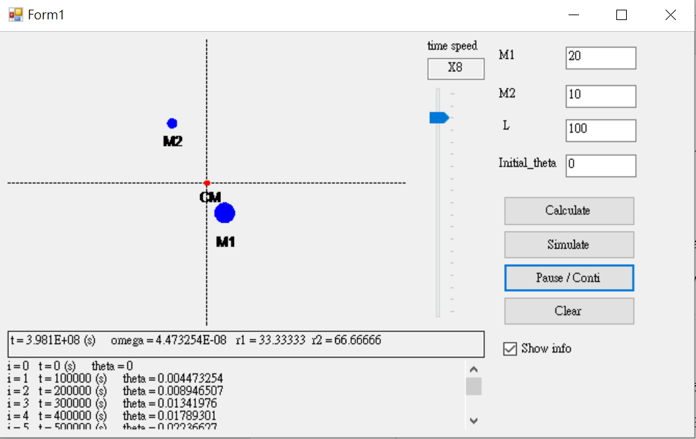
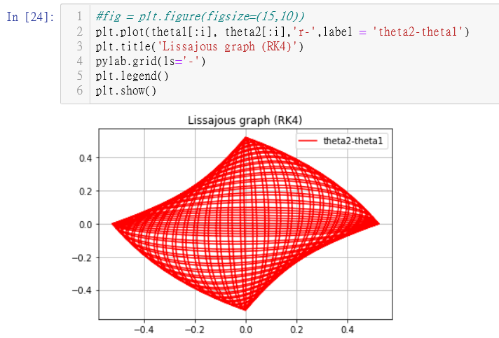

Self introduction  

Self Introduction of a MIS student

* * *

Please click Show Emoji button...

Show Emoji

*   ### About Me:
    

1.  Basic Info:

Name: Yang-Yun-Yeh

Phone: 0912345678

Gender: male

5.  College & Department:

大二: 中央資管(大一升大二時轉系)

大一: 中央物理

8.  Grade:

系級

系排

班排

大一上學期

3/47

3/47

大一下學期

1/45

1/45

大二上學期

4/107

1/53

*   ### Programming Project:
    

1.  用VB模擬雙星運動:

由於VB是以物件導向為主的程式，因此我以幾個力學公式(T=2πL^1.5 √(1/(G(M\_1+M\_2))),r\_1=M\_2/(M\_1+M\_2 )×L)、while迴圈和一些array來計算、儲存模擬的data並運用Picture Box、Timer把結果以簡易動畫形式show出來。

  
5.  用Python模擬實驗project(coupled-driven oscillation):

在做實驗專題時，我用迴圈和6個RK4(一種數值方法)(∵有6個變數要考慮)去模擬兩個單擺中間接彈簧外加一顆步徑馬達施加週期性外力的運動狀態。經過不斷嘗試和debug，終於畫出兩個單擺θ\_2-θ\_1的Lissajous plot。

  

*   ### Reference Links:
    

1.  Go to CV web: [Click Me](https://Yang-Yun-Yeh.github.io/)

function show\_emoji(){ document.getElementById("click").innerHTML = "(・∀・) (≧▽≦) (≧∇≦)b(≧∇≦)b(≧∇≦)b"; }
